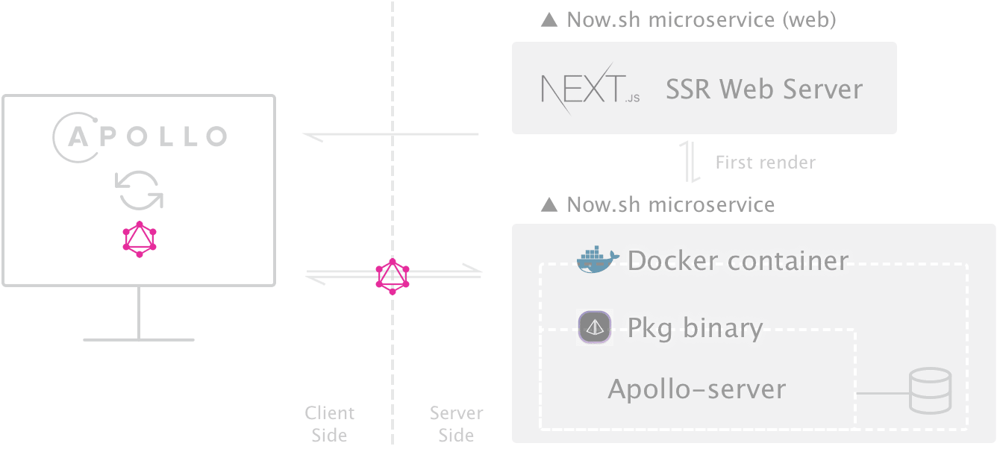
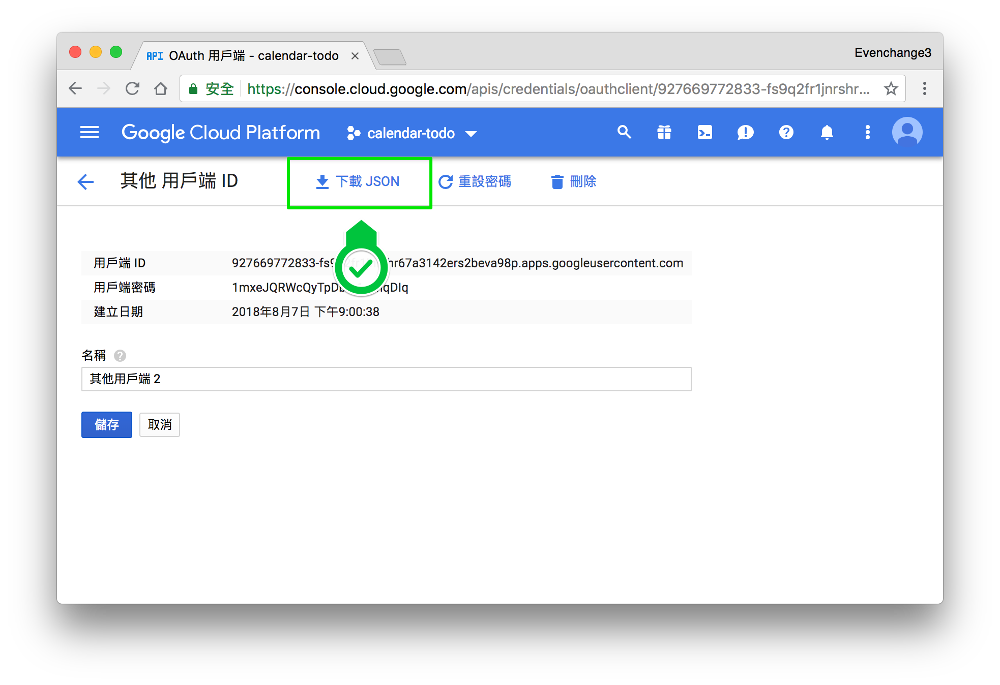
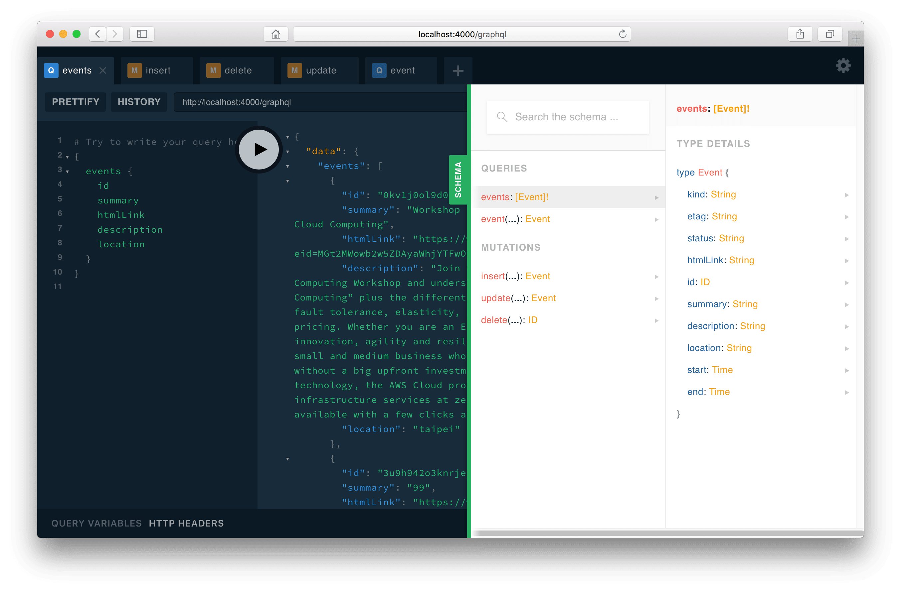
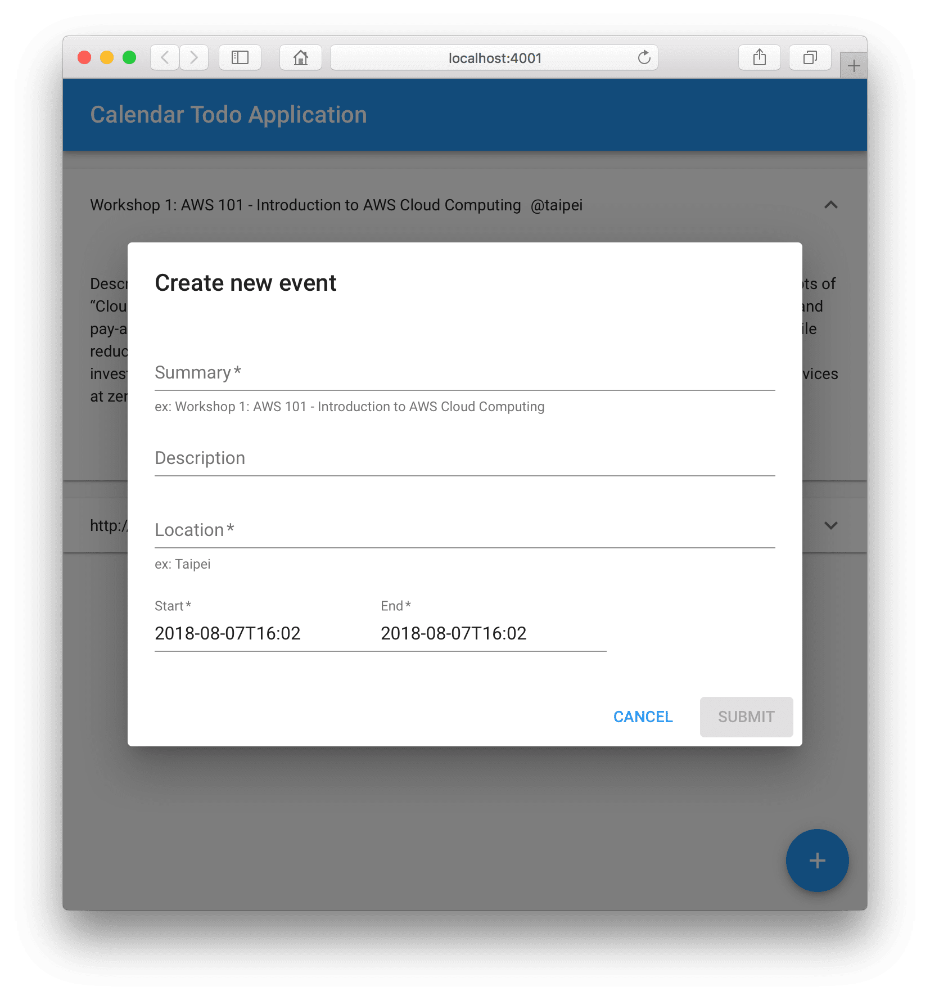

# Calendar-todo

> Google calendar todo list application with GraphQL proxy.

## Demo

https://calendar-todo-web.now.sh/

There are two micro-services in this application:

1. [GraphQL Server](#graphql-server): GraphQL proxy to Google calendar API
2. [Web](#web-server): Website portal



## Usage

```shell
$ docker run --rm -it \
  -p 4000:4000 \
  -e "NODE_ENV=production" \
  -e "PORT=4000" \
  -e "DEBUG=server" \
  -e "GOOGLE_CLIENT_ID=927669772833-ou0jjulc4p68dbfmfnltjqk83rgd5mtr.apps.googleusercontent.com" \
  -e "GOOGLE_CLIENT_SECRET=jmn2fzU9n55PIX6FwswyWcDV" \
  -e "GOOGLE_REDIRECT_URL=urn:ietf:wg:oauth:2.0:oob" \
  calendar-todo/server
# Enter the code...

$ docker run --rm -it \
  -p 4001:4001 \
  -e "NODE_ENV=production" \
  -e "PORT=4001" \
  -e "DEBUG=web" \
  -e "API_DOMAIN=http://localhost:4000/graphql" \
  calendar-todo/web
```

Screenshot:


## Technology Stack

- Apollo server 2 - GraphQL proxy server
- Next.js - React Server side render
- Apollo client
- Material-ui
- Docker & Pkg - binary in docker

## Development

- node >= v10.7.0
- yarn >= 1.9.4

### Get Google API Key

Your application must use OAuth 2.0 to authorize requests.
https://developers.google.com/calendar/auth

Screenshot:


### GraphQL server

```shell
$ cd packages/server
$ cp .env.example .env # input your own config
$ npm run dev # dev server
> 🚀 Server ready at http://localhost:4000/graphql

# or
$ docker build -t calendar-todo/server .
```

| **Variable**         | **Default**  | **Description**               |
| -------------------- | ------------ | ----------------------------- |
| NODE_ENV             | `production` |                               |
| PORT                 | `4000`       | Server port                   |
| DEBUG                | `server`     | for npm debug                 |
| GOOGLE_CLIENT_ID     |              | client id of google oauth     |
| GOOGLE_CLIENT_SECRET |              | client secret of google oauth |
| GOOGLE_REDIRECT_URL  |              | redirect url of google oauth  |

Screenshot:


---

### Web server

```shell
$ cd packages/web
$ cp .env.example .env # input your own config
$ npm run dev # dev server
> Ready on http://localhost:4001

# or
$ docker build -t calendar-todo/web .
```

| **Variable** | **Default**  | **Description**                     |
| ------------ | ------------ | ----------------------------------- |
| NODE_ENV     | `production` |                                     |
| PORT         | `4001`       | Server port                         |
| DEBUG        | `web`        | for npm debug                       |
| API_DOMAIN   |              | Domain name of GraphQL proxy server |

Screenshot:

